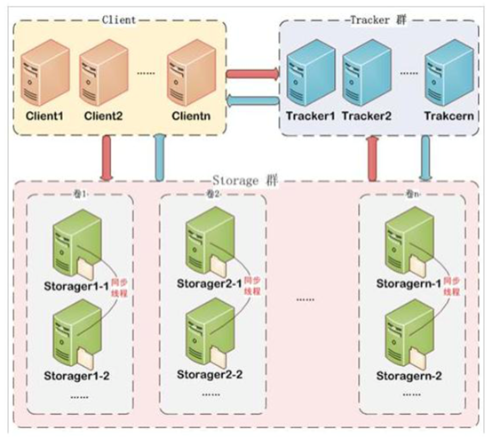
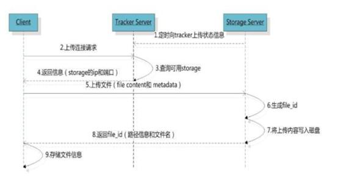
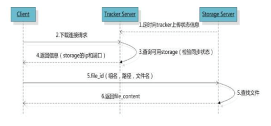
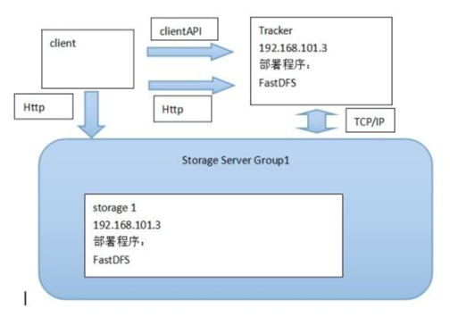
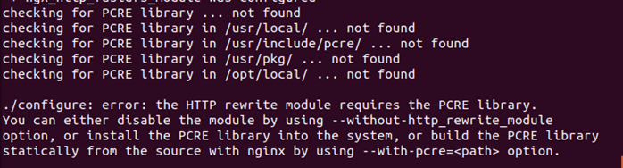
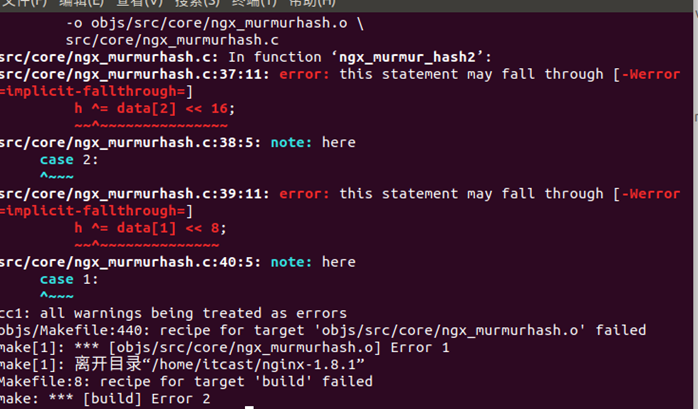
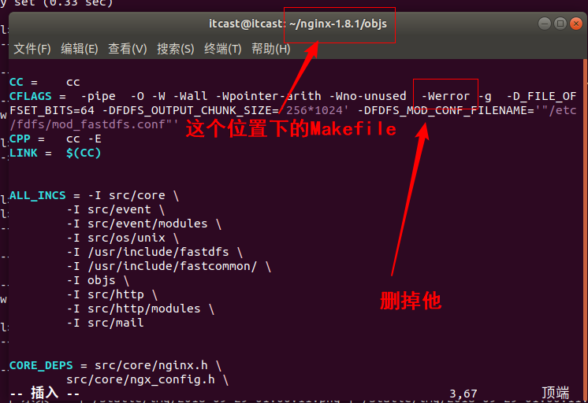
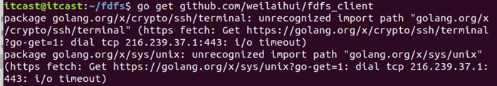

# 利用fastDFS存储图片

## 什么是FastDFS

FastDFS 是用 c 语言编写的一款开源的分布式文件系统。FastDFS 为互联网量身定制， 充分考虑了冗余备份、负载均衡、线性扩容等机制，并注重高可用、高性能等指标，使用 FastDFS 很容易搭建一套高性能的文件服务器集群提供文件上传、下载等服务。

优点： 

FastDFS 架构包括 Tracker server 和 Storage server。客户端请求 Tracker server 进行文 件上传、下载，通过 Tracker server 调度最终由 Storage server 完成文件上传和下载。 

Tracker server 作用是负载均衡和调度，通过 Tracker server 在文件上传时可以根据一些 方法找到 Storage server 提供文件上传服务。可以将 tracker 称为追踪服务器或调度服务 器。 

Storage server 作用是文件存储，客户端上传的文件最终存储在 Storage 服务器上， Storageserver 没有实现自己的文件系统而是利用操作系统 的文件系统来管理文件。可以将 storage 称为存储服务器。 



服务端两个角色: 

Tracker:管理集群，tracker 也可以实现集群。每个 tracker 节点地位平等。收集 Storage 集群的状态。 

Storage:实际保存文件 

Storage 分为多个组，每个组之间保存的文件是不同的。每 个组内部可以有多个成员，组成员内部保存的内容是一样的，组成员的地位是一致的，没有 主从的概念。

## 文件上传流程 



客户端上传文件后存储服务器将文件 ID 返回给客户端，此文件 ID 用于以后访问该文 件的索引信息。文件索引信息包括:组名，虚拟磁盘路径，数据两级目录，文件名。


**组名**: 文件上传后所在的 storage 组名称，在文件上传成功后有 storage 服务器返回， 需要客户端自行保存。 

**虚拟磁盘路径**: storage 配置的虚拟路径，与磁盘选项 store_path*对应。如果配置了 store_path0 则是 M00，如果配置了 store_path1 则是 M01，以此类推。 

**数据两级目录 **:storage 服务器在每个虚拟磁盘路径下创建的两级目录，用于存储数据 文件。 

**文件名** :与文件上传时不同。是由存储服务器根据特定信息生成，文件名包含:源存储 服务器 IP 地址、文件创建时间戳、文件大小、随机数和文件拓展名等信息。

## 文件下载流程



## 简易FastDFS架构



## FastDFS安装

## 安装FastDFS依赖包

1. 解压缩libfastcommon-master.zip
2. 进入到libfastcommon-master的目录中
3. 执行 **./make.sh**
4. 执行**sudo ./make.sh install**

## 安装FastDFS

1. 解压缩fastdfs-master.zip
2. 进入到 fastdfs-master目录中
3. 执行 **./make.sh**
4. 执行 **sudo ./make.sh install**

## 配置跟踪服务器tracker

1. ```shell
   sudo cp /etc/fdfs/tracker.conf.sample /etc/fdfs/tracker.conf
   ```

2. 在/home/itcast/目录中创建目录 fastdfs/tracker      

   ```shell
   mkdir –p /home/itcast/fastdfs/tracker
   ```

3. 编辑/etc/fdfs/tracker.conf配置文件    
```shell
sudo vim /etc/fdfs/tracker.conf
修改base_path=/home/itcast/fastdfs/tracker
```
## 配置存储服务器storage 

1. ```
   sudo cp /etc/fdfs/storage.conf.sample /etc/fdfs/storage.conf
   ```
2. 在/home/itcast/fastdfs/ 目录中创建目录 storage

   ```shell
   mkdir –p /itcast/fastdfs/storage
   ```

3. 编辑/etc/fdfs/storage.conf配置文件  
```shell
sudo vim /etc/fdfs/storage.conf
```

修改内容：
   ```shell
   base_path=/home/itcast/fastdfs/storage
   store_path0=/home/itcast/fastdfs/storage
   tracker_server=自己ubuntu虚拟机的ip地址:22122
   ```

##3.2.5.5启动tracker和storage

进入到/etc/fdfs/下面执行以下两条指令

```shell
sudo  fdfs_trackerd  /etc/fdfs/tracker.conf
sudo fdfs_storaged  /etc/fdfs/storage.conf
```

## 测试是否安装成功

1. ```shell
sudo cp /etc/fdfs/client.conf.sample /etc/fdfs/client.conf
```
2. 编辑/etc/fdfs/client.conf配置文件  
```shell
sudo vim /etc/fdfs/client.conf
```

修改内容：
```shell
base_path=/home/fastdfs/tracker
tracker_server=自己ubuntu虚拟机的ip地址:22122
```

3. 上传文件测试(fastDHT)
```shell
sudo fdfs_upload_file /etc/fdfs/client.conf 要上传的图片文件
   ``` 

   如果返回类似
   ```shell
   group1/M00/00/00/rBIK6VcaP0aARXXvAAHrUgHEviQ394.jpg
   ``` 
   文件id则说明文件上传成功

## 安装fastdfs-nginx-module

1. 解压缩 nginx-1.8.1.tar.gz

2. 解压缩 fastdfs-nginx-module-master.zip

3. 进入nginx-1.8.1目录中

4. 执行

   ```shell
   sudo ./configure  --prefix=/usr/local/nginx/ --add-module=fastdfs-nginx-module-master解压后的目录的绝对路径/src
   ```

   注意：**这时候会报一个错，说没有PCRE库**

   

   下载缺少的库

   ```shell
   sudo apt-get install libpcre3 libpcre3-dev
   ```

   + 首先你需要去更换源，因为ubuntu自带的源没有这个库

   + 更换下载源为阿里的源

   + 先把原来的源文件备份

     ```shell
     sudo cp /etc/apt/sources.list /etc/apt/sources.list.bak
     ```

   + 编辑源文件

     ```shell
     sudo vim /etc/apt/sources.list
     ```

     把原来的内容全部删掉，粘贴一下内容：

     ```shell
     deb http://mirrors.aliyun.com/ubuntu/ bionic main restricted universe multiverse
     deb-src http://mirrors.aliyun.com/ubuntu/ bionic main restricted universe multiverse
      
     deb http://mirrors.aliyun.com/ubuntu/ bionic-security main restricted universe multiverse
     deb-src http://mirrors.aliyun.com/ubuntu/ bionic-security main restricted universe multiverse
      
     deb http://mirrors.aliyun.com/ubuntu/ bionic-updates main restricted universe multiverse
     deb-src http://mirrors.aliyun.com/ubuntu/ bionic-updates main restricted universe multiverse
      
     deb http://mirrors.aliyun.com/ubuntu/ bionic-proposed main restricted universe multiverse
     deb-src http://mirrors.aliyun.com/ubuntu/ bionic-proposed main restricted universe multiverse
      
     deb http://mirrors.aliyun.com/ubuntu/ bionic-backports main restricted universe multiverse
     deb-src http://mirrors.aliyun.com/ubuntu/ bionic-backports main restricted universe multiverse
     ```

     更换完源之后执行

     ```shell
     sudo apt-get  update
     sudo apt-get install libpcre3 libpcre3-dev
     ```

     然后进入nginx-1.8.1目录中，再次执行：

     ```shell
     sudo ./configure --prefix=/usr/local/nginx/ --add-module=fastdfs-nginx-module-master解压后的目录的绝对路径/src
     ```

     这时候还会报一个错，错误原因是因为nginx编译的时候把警告当错误处理，事实上这个警告并不影响（程序员忽略警告）：

     

     解决方法：
     找到objs目录下的Makefile
    ```shell
    cd /home/toney/fastDFS/nginx-1.8.1/objs
    ```

     ```shell
     vim Makefile
     ```

     删掉里面的-Werror(**如果没有修改权限，修改一下这个文件的权限,`chmod 777 Makefile`**)

     


     执行完成后执行**sudo make**

     执行**sudo make install** 

     然后回到nginx-1.8.1目录中，再次执行：

     ```shell
     sudo ./configure  --prefix=/usr/local/nginx/ --add-module=fastdfs-nginx-module-master解压后的目录的绝对路径/src
     ```

5. 
```shell
sudo cp fastdfs-nginx-module-master解压后的目录中src下mod_fastdfs.conf   /etc/fdfs/mod_fastdfs.conf
```

6. sudo vim /etc/fdfs/mod_fastdfs.conf

修改内容：

 ```shell
connect_timeout=10
tracker_server=自己ubuntu虚拟机的ip地址:22122
url_have_group_name=true
store_path0=/home/fastdfs/storage
```

7. 
```shell 
sudo cp 解压缩的fastdfs-master目录中的conf中的http.conf  /etc/fdfs/http.conf
```
8. 
```shell 
sudo cp 解压缩的fastdfs-master目录中的conf中的mime.types /etc/fdfs/mime.types
```
9. 
```shell 
sudo vim /usr/local/nginx/conf/nginx.conf
```

   在http部分中添加配置信息如下：

   ```shell
   server {
               listen       8888;
               server_name  localhost;
               location ~/group[0-9]/ {
                   ngx_fastdfs_module;
               }
               error_page   500 502 503 504  /50x.html;
               location = /50x.html {
               root   html;
               }
           }
   
   ```

10. 启动nginx
```shell
    sudo  /usr/local/nginx/sbin/nginx
```
## 使用go客户端上传文件测试

+ 下载包

  ```shell
  go get github.com/weilaihui/fdfs_client
  ```

  这时候会报一个错：

  

  这是因为我们的网络有防火墙，不能直接去google下载相应的包，所以就失败啦

  解决办法：

   在~/workspace/go/src目录下面创建一个golang.org/x目录

    ``` shell
    cd  ~/workspace/go/src
    mkdir -p golang.org/x
    ```

  进入golang.org/x下载两个包

    ```shell
    cd golang.org/x
    git clone https://github.com/golang/crypto.git
    git clone https://github.com/golang/sys.git
    ```

  + 然后再执行最初的下载命令

    ```shell
    go get github.com/weilaihui/fdfs_client
    ```

+ go操作fastDFS的方法

  + 先导包，把我们下载的包导入

    ```go
    import "github.com/weilaihui/fdfs_client"
    ```

  + 导包之后,我们需要指定配置文件生成客户端对象

    ```go
    client,_:=fdfs_client.NewFdfsClient("/etc/fdfs/client.conf")
    ```

  + 接着我们就可以通过client对象执行文件上传，上传有两种方法，一种是通过文件名，一种是通过字节流

    + 通过文件名上传**UploadByFilename**,参数是文件名（必须通过文件名能找到要上传的文件），返回值是fastDFS定义的一个结构体，包含组名和文件ID两部分内容

      ```go
      fdfsresponse,err := client.UploadByFilename("flieName")
      ```

    + 通过字节流上传**UploadByBuffer**,参数是字节数组和文件后缀，返回值和通过文件名上传一样。

      ```go
      fdfsresponse,err := client.UploadByBuffer(fileBuffer,ext)
      ```